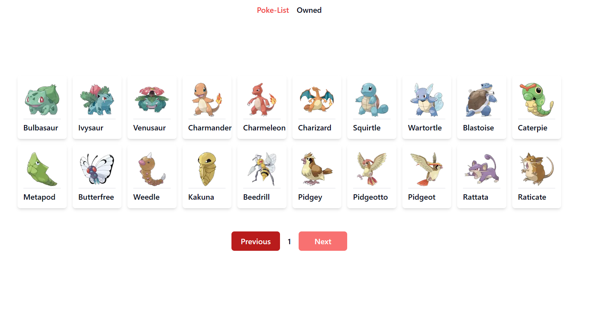
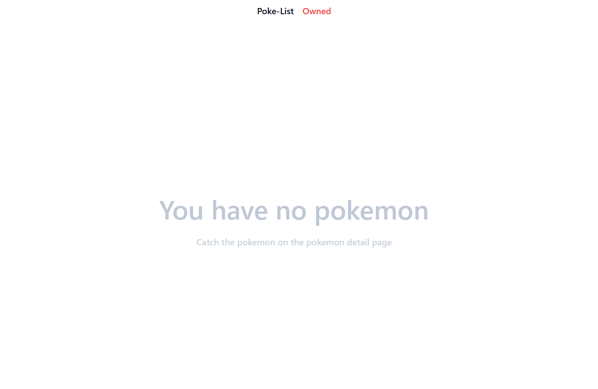
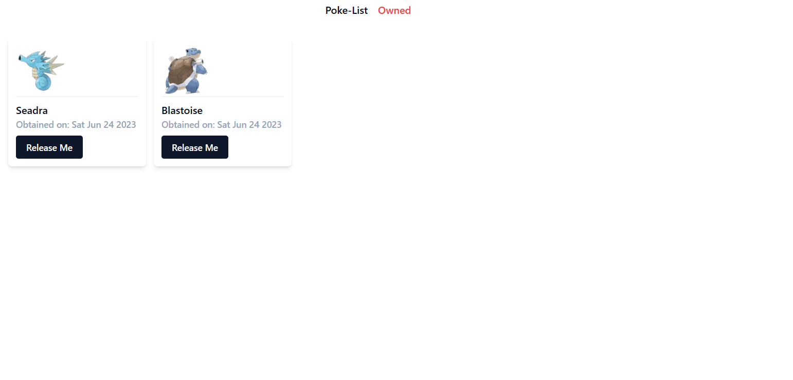
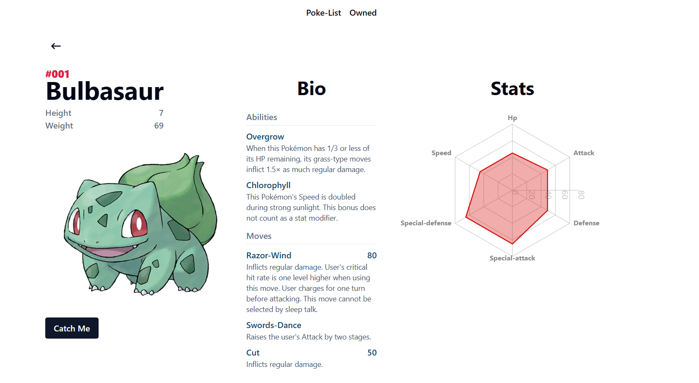
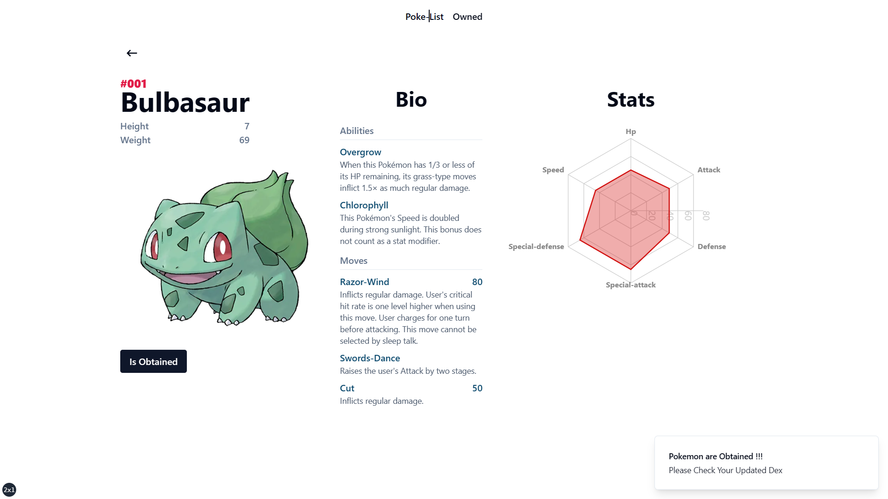

This is a [Next.js](https://nextjs.org/) project bootstrapped with [`create-next-app`](https://github.com/vercel/next.js/tree/canary/packages/create-next-app).

## Getting Started

Technology used :

- Nextjs 13
- Typescript
- TailwindCSS
- Rechart (Chart)
- ShadcnUI

Install dependency

```bash
npm install
# or
yarn install
# or
pnpm install
```

First, run the development server:

```bash
npm run dev
# or
yarn dev
# or
pnpm dev
```

Open [http://localhost:3000](http://localhost:3000) with your browser to see the result.

## Pages

This project contains 3 pages

- Pokemon List page on [http://localhost:3000](http://localhost:3000)
- Owned Pokemon on [http://localhost:3000/owned](http://localhost:3000/owned)
- Detaild Pokemon on [http://localhost:3000/1](http://localhost:3000/1) (#example: [slug] = 1)

You can check out all pages code on app directory or image bellow

### **Poke-List**



### Owned Pages

in this page contains 2 states 

**Empty Pokemon**




**Owned Pokemon**



#### **Pokemon Details**

in this page contains 2 states 

**Pokemon not Obtained**



**Obtained Pokemon**


